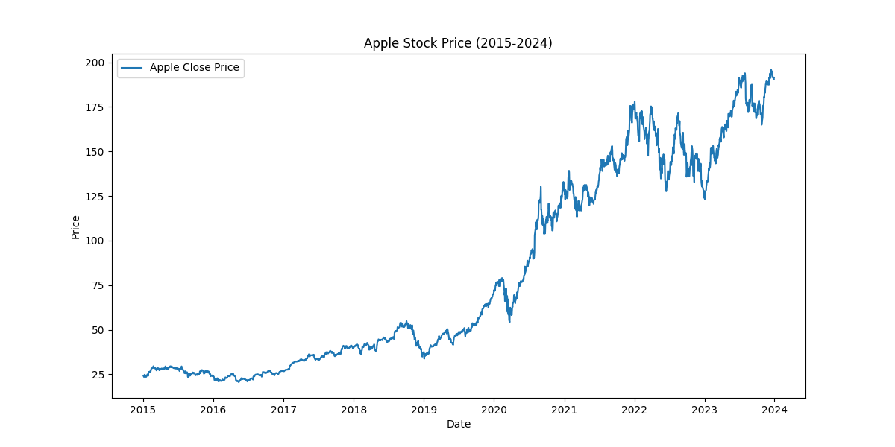
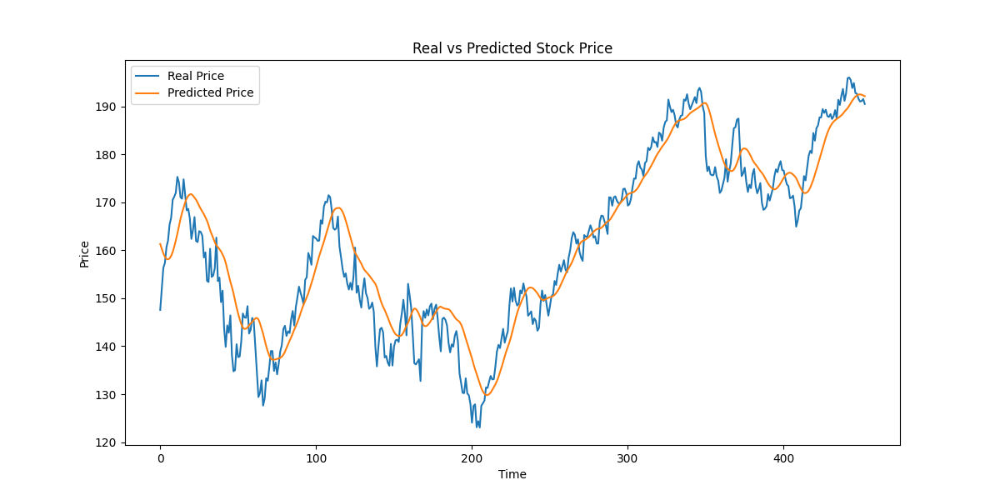
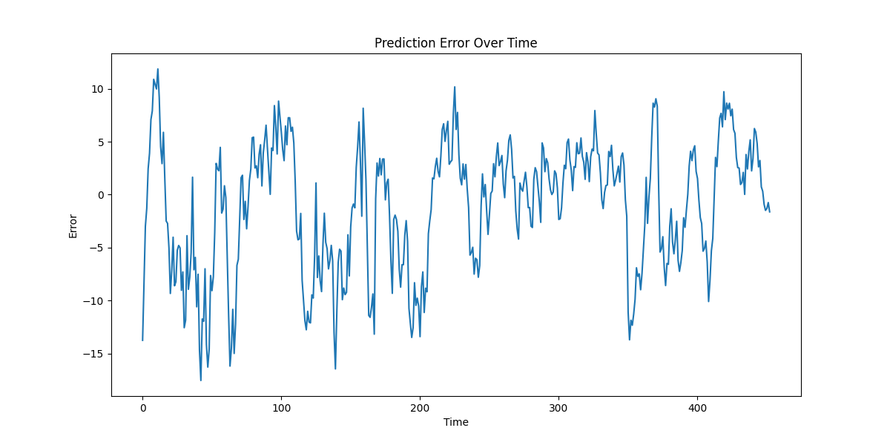
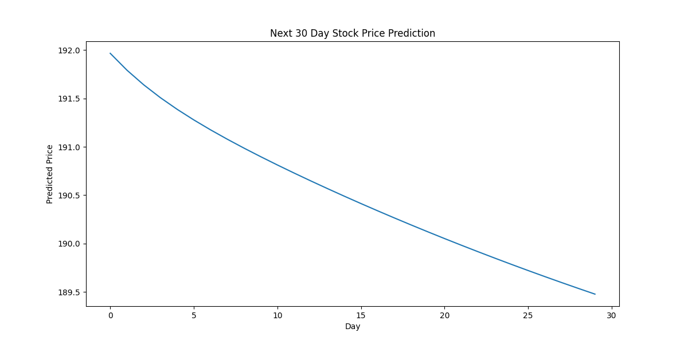

# AI Stock Price Prediction using LSTM

This project demonstrates stock price prediction using a Long Short-Term Memory (LSTM) neural network, a deep learning architecture designed for time-series forecasting. The model is trained on historical Apple (AAPL) stock data obtained from Yahoo Finance to learn patterns in financial time-series data and generate future price predictions. Stock markets produce sequential data where each value depends on previous values, making LSTM networks particularly effective for modeling long-term dependencies and trends in stock prices.

## Project Overview

Stock price prediction is a challenging problem due to market volatility and non-linear relationships in financial data. Traditional machine learning algorithms often struggle to capture temporal dependencies in sequential datasets. To address this, this project uses a deep learning LSTM network that learns patterns from historical stock prices and predicts future values based on learned trends.

The project covers the entire machine learning pipeline including data collection, preprocessing, feature scaling, sequence generation, model training, prediction, and evaluation.

## Technologies Used

Python
TensorFlow / Keras
Pandas
NumPy
Matplotlib
Scikit-learn
Yahoo Finance API (yfinance)

## Dataset

Source: Yahoo Finance
Stock: Apple Inc. (AAPL)
Time Period: 2015 – 2024

Dataset features include:

Open price
High price
Low price
Close price
Trading volume

The closing price is used as the main prediction target for training the model.

## Data Processing Pipeline

The workflow of this project includes the following steps:

1. Download historical stock data using the Yahoo Finance API
2. Normalize the price values using MinMaxScaler to improve neural network training
3. Create time sequences of 60 previous days as input features
4. Train an LSTM neural network on the sequential data
5. Generate predictions for stock prices
6. Compare predicted prices with real prices
7. Evaluate model performance using RMSE and MAE metrics
8. Visualize historical trends, predictions, and prediction errors

## Model Architecture

The neural network used in this project contains:

LSTM Layer (50 units)
LSTM Layer (50 units)
Dense Output Layer (1 unit)

Optimizer: Adam
Loss Function: Mean Squared Error

This architecture allows the model to learn complex temporal dependencies in stock market data.

## Historical Stock Price

## Real vs Predicted Stock Price

## Prediction Error Analysis

## Future 30-Day Prediction

## Model Evaluation

The model performance is evaluated using two standard regression metrics:

RMSE (Root Mean Squared Error) – measures the average magnitude of prediction errors
MAE (Mean Absolute Error) – measures the average absolute difference between predicted and real values

These metrics help determine how accurately the model predicts stock prices.

## How to Run the Project

Install the required dependencies:

pip install -r requirements.txt

Launch Jupyter Notebook:

jupyter notebook

Open the notebook file:

stock_prediction.ipynb

Run all cells to reproduce the training process and generate predictions.

## Learning Outcomes

This project demonstrates practical implementation of deep learning techniques for financial time-series forecasting. It covers data preprocessing, neural network modeling, sequence generation for LSTM networks, model evaluation, and visualization of predictions. The project highlights how deep learning can be applied to analyze financial markets and predict trends using historical data.

## Author

Henil Modi
A student
Interested in Artificial Intelligence, and Software development.
